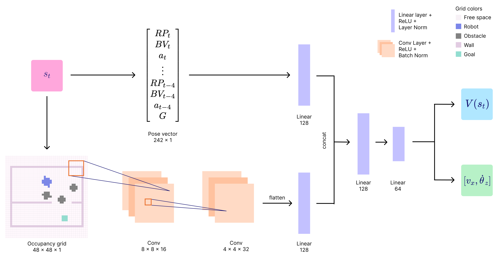

# namo_experiment
This repository contains code for implementing the neural network on Unitree GO1. The overview of the workflow consists of 
1) detecting markers from cameras 
2) preprocess detections into the appropriate input format
3) feed foward input in network
4) post process network outputs
5) send output signals to robot 

## Marker setup
We use Aruco markers to detect obstacles and track the robot's poses in real time. The aruco markers can be generated from https://chev.me/arucogen/. The aruco marker detection and calibration code is adapted from https://github.com/RPL-CS-UCL/Aruco_marker_pose_estimation to accomodate multiple cameras and arbitrary number of markers.

Once the markers are set up in the scene, the information about the markers should be inputed in `obs/markers.json`. One of the markers should be set to the reference marker

## Camera setup
This experiment uses two realsense cameras to accurately track the experiment. You could also modify the file `obs/marker_detector` to change the number of cameras. For each camera input we generate a `MarkerDetector` class, that is handled altogether by a wrapper class `MarkerDetectorMulti` to fuse different camera inputs. Note that a detector will not output anything if the reference frame is not found in the scene.

## Preprocessing input
For the specific experiment we preprocess in the camera input into a vector and a grid. The grid is computed in the file `compute_occ_grid`. The vector is generated in `compute_namo_obs`. For details on the input space please see our paper on local NAMO with DRL.

## Neural network forward pass
The preprocessed input is passed into a pre-trained neural network. The network is first built in the same way as the implementation in `rl_games`: https://github.com/Denys88/rl_games, with some custom definition of forward pass. The network is then loaded with weights, we add two example weights in the `weights` folder. Note that the current versions of the network is only stable with a fixed configuration of walls which can be found in `test_map_ep750.pth`, and the `all_maps_ep1050.pth` can be used in any map settings, but may produce unstable behaviours.

## Control threads
There are two threads to control the robot. The main thread is responsible for sending signals to the robot and negotiating commands between the network outputs and the gamepad outputs (to overwrite the network). The secondary thread is responsible for taking the camera observation, preprocessing the camera data, and perform forward pass to the neural network at 3Hz. The main control logic to run on the robot is found in `run_namo_network.py`. Detailed implementation of controlling Unitree robots can be found in https://github.com/RPL-CS-UCL/Unitree_Controller.